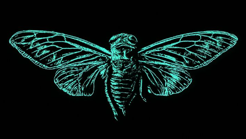
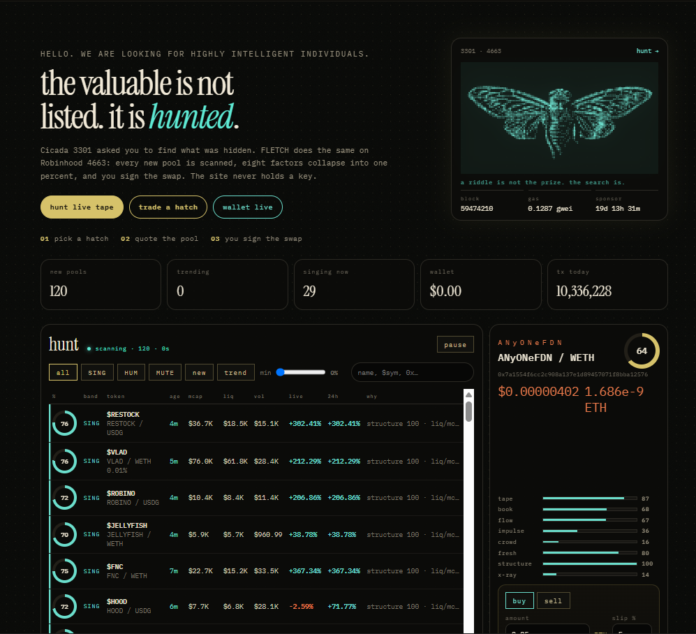

<p align="center">
  
</p>

<h1 align="center">FLETCH</h1>

<p align="center">
  <strong>Robin Hood Chain</strong><br>
  the valuable is not listed. it is hunted.
</p>

<p align="center">
  Live hatch tape for <a href="https://robinhood.com/chain">Robin Hood Chain</a>.<br>
  New Robin Hood pools are scanned, scored as a percent, and swapped from your wallet.<br>
  Non-custodial. You sign every send on Robin Hood.
</p>

<p align="center">
  <a href="https://fletch.cash"><strong>fletch.cash</strong></a>
  ·
  Robin Hood Chain
</p>

<p align="center">
  
  
  
  
  
</p>

<p align="center"><code>ROBIN HOOD CHAIN · HELLO. WE ARE LOOKING FOR HIGHLY INTELLIGENT INDIVIDUALS.</code></p>

---

<p align="center">
  
</p>

## What it is

Cicada 3301 hid the prize in the search. FLETCH does the same on **Robin Hood Chain**.

Every few seconds the hunt pulls **new and trending Robin Hood pools**, collapses eight factors into one percent, and paints **SING / HUM / MUTE**. Click a hatch, quote the Robin Hood pool, sign the swap. The site never holds a key.

| You see | What it actually does |
| --- | --- |
| hunt tape | GeckoTerminal new + trending Robin Hood pools, rescored each pass |
| live / 24h | 5-minute move vs daily move, teal up / bronze down |
| wallet | ETH + WETH + USDG on Robin Hood, marked to the explorer price |
| tx today | Robin Hood network transactions today, live from Blockscout |
| swap | Uniswap V4 on Robin Hood Chain (Pons hooks included). You confirm in Rabby / MetaMask |

Bands: **SING** ≥ 68 · **HUM** 42–67 · **MUTE** below that.

## Score

| Factor | Reads |
| --- | --- |
| tape | Robin Hood 24h / 1h / 5m volume |
| book | pool liquidity on Robin Hood Uniswap |
| flow | buys vs sells |
| impulse | 5m / 1h percent + scan tick |
| crowd | holders / top-10 when Blockscout answers |
| fresh | age sweet-spot (too raw and too old both lose) |
| structure | liquidity versus market cap |
| x-ray | Twitter handle heat when DexScreener has a link |

Penalties for thin books, sell-side tape, dumps, and exit-risk mcap.

## Live

The Robin Hood hunt is at **[fletch.cash](https://fletch.cash)**.

Connect a wallet, add **Robin Hood Chain**, pick a hatch, quote the pool, sign the swap. The site never holds a key.

**add Robin Hood** on the tape injects Robinhood Chain into an EIP-1193 wallet.

## Stack

Vanilla HTML / CSS / JS. No React. No bundler required for `scripts/serve.mjs`.

```
index.html          landing + hunt + trade + roadmap
src/ui.js           views, tape, wallet, quotes
src/chain.js        Robin Hood RPC, V4 quote / swap, wallet
src/market.js       GeckoTerminal + DexScreener
src/score.js        eight factors → percent
src/cicada.js       dotted cicada from cicada.png
scripts/serve.mjs   static + short-TTL proxies
```

| Piece | Address / URL |
| --- | --- |
| chain | Robin Hood Chain |
| RPC | `https://rpc.mainnet.chain.robinhood.com` |
| explorer | [robinhoodchain.blockscout.com](https://robinhoodchain.blockscout.com) |
| WETH | `0x0Bd7D308f8E1639FAb988df18A8011f41EAcAD73` |
| USDG | `0x5fc5360D0400a0Fd4f2af552ADD042D716F1d168` |
| V4 PoolManager | `0x8366a39CC670B4001A1121B8F6A443A643e40951` |
| V4 Quoter | `0x8dc178efb8111bb0973dd9d722ebeff267c98f94` |
| live swap router | `0x65050a9b7e5075a2ba5ced7b1b64ee66262c40dc` |
| Pons V2 MemeHook | `0xe5e702641ea86f4ae6cc3cdaed2b886f976be044` |

The USDG ticker squatter `0x8218…BB5b4` is refused.

## Roadmap

Hunt first on Robin Hood. Host + domain second. Alerts third. Execution fourth. Prose last.

`/` stays the Robin Hood hunt on [fletch.cash](https://fletch.cash). Optional desk is not the front door.

## Disclaimer

Not financial advice. FLETCH never holds keys. Every live trade on Robin Hood Chain is `eth_sendTransaction` you confirm in the wallet.
